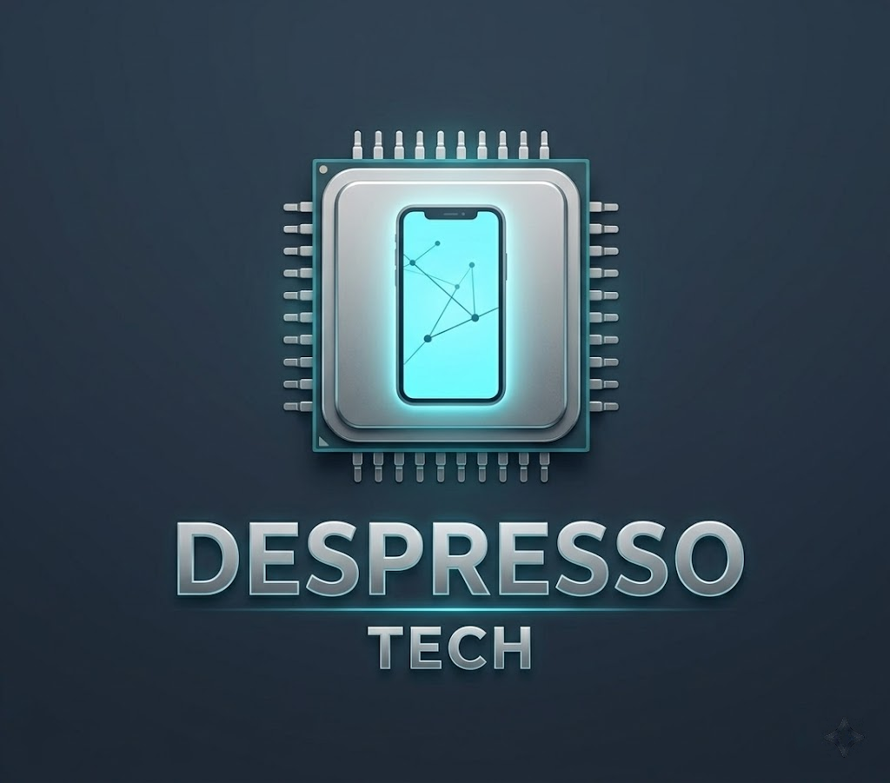

# ⚡ Despresso Tech — Professional PC Building & Diagnostics Platform

<p align="center">
  
</p>

<p align="center">
  <b>Reanimating dead hardware and delivering high-performance computing solutions.</b>
</p>

<p align="center">
  <a href="https://www.facebook.com/share/19AcufBvdo/">
    
  </a>
  <a href="https://wa.me/201140009830">
    
  </a>
</p>

---

## 📌 Project Overview

**Despresso Tech** is a dark-themed, interactive web application built to serve as the digital storefront and diagnostics portal for *Despresso Tech*. The brand focuses on custom PC builds, hardware troubleshooting, thermal maintenance, clean OS setups, and restoring malfunctioning hardware to optimal functionality.

The platform provides a seamless user experience (UX) with a custom **Interactive Diagnostic Form** that directly communicates technical issues to the technician via WhatsApp API.

---

## ✨ Key Features

* **🎨 Cyberpunk & Cyan Tech Branding:** Customized UI/UX matching the brand’s CPU & Smartphone identity (Cyan glow `#00e5ff` on slate dark background).
* **🛠️ Interactive Diagnostics Tool:** Allows clients to select specific PC issues (overheating, failed boot, OS setup) and auto-generates a formatted WhatsApp inquiry.
* **📂 Real Case Studies:** Features real-life hardware overhaul cases (e.g., restoring a completely dead PC with a blown PSU).
* **💬 Client Testimonials:** Showcases authentic customer feedback highlighting service transparency and build quality.
* **📱 Fully Responsive:** Optimized layout using modern CSS Grid and Flexbox for all screen sizes.

---

## 🛠️ Tech Stack

* **Front-End:** HTML5, CSS3 (Custom Variables, Flexbox, CSS Grid)
* **Logic & Integration:** Modern JavaScript (ES6+), DOM Manipulation, Web APIs (WhatsApp API)
* **Typography:** Google Fonts (`Cairo`)
* **Deployment:** Vercel CI/CD

---

## 📂 Project Structure

```text
├── index.html       # The core structural application & sections
├── style.css        # Custom dark-cyan styling & responsive layout
├── script.js        # Dynamic UI interaction & WhatsApp API logic
├── logo.jpg         # Brand Identity asset
└── README.md        # Project documentation
